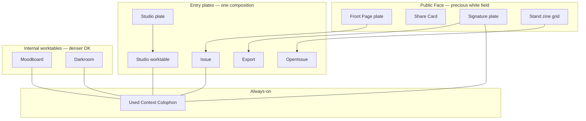

# UX / UI Plan — Mimi Aesthetic System

**Status**: Ideation  
**Parent**: [`aesthetic-system-overview.md`](./aesthetic-system-overview.md)  
**Proofs directory**: [`proofs/aesthetic/`](../proofs/aesthetic/)

---

## 1. Ideation summary

Mimi’s advantage is not “AI that looks editorial.” It is an **archival operating system** where approved evidence becomes printable identity. The seven aesthetic pillars collapse into one plan:

| Layer | Intent |
|-------|--------|
| **System** | House Style v2 — B/W + olive/stone, Cormorant/Geist, cool grain |
| **Rooms** | One composition entry plates for Studio, Signature, Stand, Front Page |
| **Objects** | Signature plate + Stand grid as shareable brand artifacts |
| **Worktables** | Canvas-first Moodboard/Studio/Darkroom; tools in sheets/rails |
| **Differentiator** | Used Context as colophon (always-on provenance) |
| **Motion** | Three press mechanics only |
| **Public kit** | One face across Front Page / Share / Signature / Stand |

---

## 2. Information architecture (aesthetic)

---

## 3. Design principles (operational)

1. **Brand first** — Wordmark/name is hero-level on public and entry plates.
2. **One job per viewport** — No chamber dashboards at entry.
3. **Artifact > chrome** — If chrome can live in a sheet, it should.
4. **Provenance is UI** — Colophon is not footer fine print; it is a press mark.
5. **Motion means something** — Stamp, page-turn, settle — or nothing.
6. **Anti-cliché** — Reject cream/serif/terracotta lifestyle defaults; reject purple glow AI defaults.

---

## 4. Component inventory (to build)

| Component | Purpose | Pillar |
|-----------|---------|--------|
| `HouseStyle` tokens / `data-surface` | public vs worktable | 01, 07 |
| `EditorialPlate` | wordmark + thesis + CTA + visual | 02 |
| `SignaturePlate` + exporters 1:1 / 9:16 | collectible | 03 |
| `StandGrid` / `ZinePlateCell` | column-ruled covers | 03, 07 |
| `WorktableShell` | canvas + sheet/rail | 04 |
| `UsedContextColophon` | quiet + expanded | 05 |
| `PressReveal`, `ApprovalStamp`, `GraphSettle` | motions | 06 |
| `PublicField`, `ColumnRule`, `PressMark` | public kit | 07 |

---

## 5. Implementation sequence

### Phase A — Lock the kit
- Land House Style v2 tokens + anti-drift checklist.
- Extract public-face primitives.
- Restyle share SVG/PNG generators toward white plates.

### Phase B — Public objects
- Signature plate + exports.
- Stand grid restyle.
- Front Page first-viewport plate (coordinate with `docs/editorial-front-page-functional-spec.md`).

### Phase C — Worktables
- Studio entry plate → worktable.
- Mobile sheet collapse for Studio / Moodboard / Darkroom.
- Wire colophon into worktables.

### Phase D — Motion + QA
- Three motions + reduced-motion.
- Design QA against proofs in `proofs/aesthetic/`.
- Playwright visual snapshots for public surfaces (follow-up).

---

## 6. Proof index

| Proof | File | Validates |
|-------|------|-----------|
| House style board | `01-house-style-board.jpg` | Tokens, type, anti-cream |
| Front Page plate | `02-front-page-plate.jpg` | One composition / public |
| Studio plate | `02-studio-plate.jpg` | One composition / entry |
| Signature 9:16 | `03-signature-plate.jpg` | Collectible object |
| Stand grid | `03-stand-grid.jpg` | Zine rack |
| Mobile worktable | `04-worktable-mobile.jpg` | Chrome collapse |
| Colophon | `05-colophon-used-context.jpg` | Provenance as design |
| Motion storyboard | `06-motion-storyboard.jpg` | Three motions |
| Public family | `07-public-face-family.jpg` | One face |

Full-resolution PNG masters also retained under `/opt/cursor/artifacts/assets/` for this agent run.

---

## 7. QA gates before ship

- **Brand test**: strip nav — still Mimi?
- **Hero budget**: entry plates within one thesis / one CTA / one visual.
- **Share test**: Signature + Stand screenshots feel precious outside the app.
- **Mobile canvas**: ≥70% height media on worktable open.
- **Colophon present**: no generate surface without quiet provenance.
- **Motion diet**: no new glow/pill patterns on covered surfaces.
- **Family test**: four public surfaces side-by-side match the kit.

---

## 8. Out of scope / exemptions

- **Oracle** retains denser cyberdeck tone; do not “print-shop” it.
- User-generated artifact palettes may break house colors **inside** the media.
- Functional publishing backend for Front Page remains owned by the editorial front-page functional spec; this plan covers aesthetic/UX shell.

---

## 9. Next decisions needed from product

1. Public surfaces light-only vs follow app theme.
2. Signature vs Stand as primary external brand object (or dual).
3. Colophon always-micro vs expandable-by-default on publish.
4. Whether Magic Patterns / Figma becomes the living kit (proofs are the interim source of truth).
