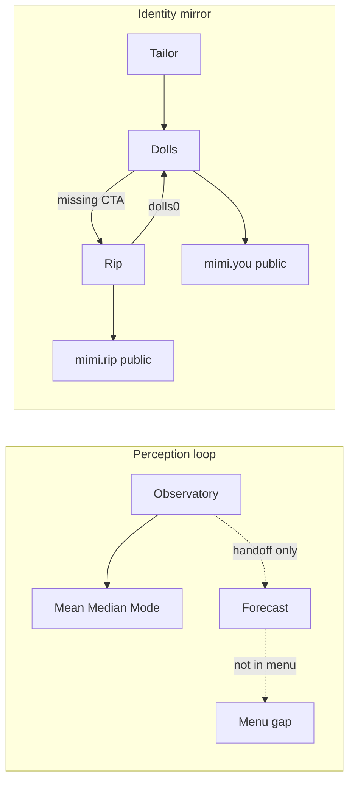

# Chamber Loop Ideation — Forecast · Observatory · Rip · Dolls

**Status**: Ideation  
**Audience**: product + implementation  
**Parent aesthetic**: [`aesthetic-ux-ui-plan.md`](./aesthetic-ux-ui-plan.md), [`aesthetic-07-public-face.md`](./aesthetic-07-public-face.md), [`doll-staple-shell.md`](./doll-staple-shell.md)

---

## 1. Verdict

Four surfaces that should feel like **two loops**, not four orphan pages:

| Loop | Chambers | Job |
|------|----------|-----|
| **Perception** | Observatory → Mean Median Mode → Forecast | What the culture is doing; what *you* should expect next |
| **Identity mirror** | Tailor → Dolls → Rip (↔ mimi.you / mimi.rip public) | Who you project; what you refuse / invert |

Today each piece is a thin live slice with broken handoffs, desktop-first layout, and incomplete aesthetic. Fix connectivity and mobile first; aestheticize Observatory as the perception entry plate; deepen Rip/Dolls as a paired public kit.

---

## 2. Current state (grounded)

### Forecast (`/forecast` · `TheForecast.tsx`)
- Routable; handoff from Observatory/Residue; **missing from live `MENU_STRUCTURE`**
- Auth-gated; not on `ChamberShell`; fixed `w-80` sidebar (mobile crush)
- Content Forecasting = simulated `researchService`; Overview drift = `Math.random()`; Cultural Shifts = static copy
- Residue’s `adaptResidueToForecast` never feeds this UI
- Dual naming debt: chamber meteorology vs Residue scenarios vs Edit “Forecast Edit” vs zine `DriftForecast`

### Observatory (`/observatory` · `ObservatoryChamber.tsx`)
- Live demo MMM dashboard only; overview vs `/mean-median-mode` collapse to the same panel
- Light `ChamberShell` + worktable chrome — not quiet/dark public-face
- Spec wants cultural ephemeris (“dim enough to perceive”); shipped UI is bordered strips
- **No eye motif**, no entry plate, Mesopic Lens copy-only
- In menu under Intelligence

### mimi.rip (`/rip` + host skins)
- Deterministic inverse reading; publish → `profile.publicRip`; public `/u/:handle` skin
- Consumes **`dolls[0]` only** (no picker); chamber links → Dolls/Tailor
- Public card drops `shadowExperiments`; no AI enrichment (v0 by design)
- Quiet dark chrome already (good public-face precedent)

### Dolls (`/mimi-dolls`)
- Shell / Universe / Shader lab; staple porcelain BJD lock (`doll-staple-shell`)
- Links → Tailor + public mimi.you; **no link to Rip**
- Not in `PUBLIC_FACE_MODES`; Tailor `field_notes` / `marketing_asset` outputs are no-ops
- Scenario projection (GAZE / SPARK WITH) deferred by PRD

---

## 3. Design principles (for these four)

1. **One composition at entry** — first viewport = brand/chamber name + one thesis + one CTA + one dominant visual. No dashboard soup.
2. **Handoffs are product** — if A consumes B’s data, A and B both link each other in chrome/actions.
3. **Public kit split** — light archival face (you / Stand / Signature) vs dark inverse face (rip). Observatory may borrow dark “ephemeris” plate without becoming Rip.
4. **Mobile: sheets over sidebars** — scope/vector/controls collapse; primary surface stays full-bleed.
5. **Kill costume metrics** — no random drift; demo data must say “demonstration”; live paths only when consented aggregates exist.
6. **House anti-cliché** — no purple glow iris, no cream lifestyle, no KPI card grids on Observatory entry.

---

## 4. Workstream A — Forecast: fix · menu · mobile

### A1. Menu & IA
- Add **Forecast** to `MENU_STRUCTURE` under Intelligence, adjacent to Observatory / Mean Median Mode.
  - Label: `Forecast` · note: `aesthetic meteorology · personal & brand drift`
  - Keywords: forecast, meteorology, drift, trends, cultural shifts
- Keep Observatory handoff chip; optionally add Forecast → Observatory reverse chip once Forecast uses `ChamberShell`.
- GuideModal: mention Forecast as Observatory’s “what next” instrument (not a separate ideology).

### A2. Shell & mobile layout
- Wrap in `ChamberShell` (or a Forecast-specific plate) for safe-area, handoffs, canon masthead.
- Replace fixed `w-80` sidebar with:
  - **Mobile**: top segment control (Overview · Content · Cultural) + optional sheet for Personal/Brand scope
  - **Desktop**: optional rail, but content-first (≥60% width)
- Drop hardcoded `#EAE8E4` / olive hexes where tokens exist (`nous-*`); keep olive only as press accent.

### A3. Data honesty (minimum to call it “fixed”)
| Surface | Fix |
|---------|-----|
| Drift % | Prefer `geo.driftScore` / profile season; if missing show “—” or “uncalibrated”, never `Math.random()` |
| Content Forecasting | Keep simulated path labeled; when gateway/keys exist, wire one real provider path *or* consume Residue forecast adapter as “from last residue run” |
| Cultural Shifts | Either drive from MMM demo report motifs or hide behind “awaiting observatory signal” empty state |
| Scope Personal/Brand | Actually filter copy + which profile fields read; or remove the toggle until it does |

### A4. Non-goals (this pass)
- Full live Exa/Perplexity pipeline
- Merging Forecast into Observatory route (keep `/forecast`; parent/child via handoff)
- Replacing WeeklyDriftReport in Pocket

### Acceptance (Forecast)
- [ ] Visible in main menu; searchable
- [ ] Usable at 390px without horizontal crush
- [ ] No random metrics
- [ ] Auth empty/signed-out states match chamber patterns
- [ ] `npm run review:mobile` spot-check passes Forecast

---

## 5. Workstream B — Observatory: aesthetic / UX (big eye)

### Intent
Make Observatory feel like **looking**, not like reading a spreadsheet. The eye is the chamber instrument — atmospheric, receipt-backed, not costume AI.

### B1. Entry plate (overview route)
First viewport, one composition:

| Slot | Content |
|------|---------|
| Dominant visual | Large iris / aperture as full-bleed or near-bleed plate (dim ink / mesopic charcoal — not purple neon) |
| Brand / name | `The Observatory` — Cormorant, hero-level |
| Thesis | Existing contract thesis (one sentence) |
| CTA | Primary → Mean Median Mode; secondary chips → Forecast, Proscenium, Residue, Scry |
| Provenance | Quiet “Demonstration specimens” / empty banner as colophon, not a hero badge |

Implementation sketch:
- `hideHeader` + self-branded plate (Rip/Scry pattern) on `/observatory`
- `/mean-median-mode` keeps denser readout **under** the same motif (smaller iris mark + strips), not a second brand system
- Add `observatory` (and optionally `mean-median-mode`) to quiet / dark-plate chrome sets when the plate goes dim

### B2. Eye as instrument (not decoration)
- Concentric rings or pupil segments map to **mean / median / mode** presence — numbers remain legible (spec: precise enough to believe)
- Pupil intensity / aperture open = “summation” or atmosphere density from demo/live report
- Mesopic Lens later: faint constellation / periphery outside the iris (Starry-Eyed · Shadow Fields) — stub as dim ring label now, no fake certainty

### B3. Motion (2–3 intentional)
1. **Aperture settle** — iris opens once on enter (reduced-motion: static open)
2. **Focus rack** — selecting MMM strip gently racks focus (blur periphery)
3. **Press stamp** — handoff / “open instrument” uses existing press mechanic language

### B4. IA split that ships
| Route | Job |
|-------|-----|
| `/observatory` | Eye plate + three tiles: Mean Median Mode · Forecast · Mesopic (coming) |
| `/mean-median-mode` | Full MMM panel (existing strips + methodology) |

### B5. Non-goals
- Live Firestore corpus aggregation (keep demo path honest)
- Mesopic full product
- Replacing Residue per-run M/M/M

### Acceptance (Observatory)
- [ ] Overview ≠ identical to MMM route
- [ ] First viewport passes brand-first / one-composition tests
- [ ] Dark plate + dark chrome (no light-over-dark seam)
- [ ] Eye motif is house-owned (ink/olive/grain), not stock “AI eye”
- [ ] Demo banner remains truthful

---

## 6. Workstream C — mimi.rip build-out

### Intent
Rip is the **dark public twin** of mimi.you. Build the connecting tissue so the inverse reading feels inevitable after a doll exists — not a dead-end chamber.

### C1. Connectivity matrix (must ship)

| From → To | Action |
|-----------|--------|
| Dolls → Rip | Chamber action + empty-state hint when a doll exists |
| Rip → Dolls / Tailor | Already wired — keep |
| Profile / mimi.you manage → Rip | Optional “Inverse reading” link when `publicRip` or doll exists |
| Rip ↔ doll binding | **Doll picker** (default last-used / active studio doll, not `dolls[0]`) |
| Public rip → you card | Keep; ensure reciprocal “See inverse” from you card when published |
| Stand / Floor | Defer badge unless cheap: published-rip mark on shelf cell |

### C2. Product depth (ordered)
1. **Parity**: surface `shadowExperiments` on public snapshot *or* remove from private UI so private/public match
2. **Empty states**: clear path Tailor → Doll → Rip when graph empty
3. **Re-derive UX**: show which doll/likeness fed the reading; confirm before overwrite publish
4. **Enrichment (later)**: optional gateway pass for denser prose — keep deterministic core as SoT
5. **Host QA**: `?skin=rip` + real host checklist; landing CTA into signed-in `/rip`

### C3. Aesthetic lock
- Preserve quiet dark chrome + inverse plate language
- One `Mimi` wordmark treatment; no CSS-uppercase `MIMI`
- Public rip remains sparse: anti-motifs, opposite palette, silhouette/register — not a second dashboard

### Acceptance (Rip)
- [ ] Bidirectional Dolls ↔ Rip navigation
- [ ] Active/selected doll drives reading
- [ ] Public/private field parity decided and implemented
- [ ] Mobile dark plate review checklist green

---

## 7. Workstream D — Dolls & connecting pages

### Intent
Dolls stay the **porcelain projection shell**; connecting pages should make Shell → Universe → public you → Rip feel like one identity kit.

### D1. Chamber UX fixes
- Add **Open mimi.rip** action (mirror Rip’s Open Dolls)
- Empty shell: Tailor CTA primary; secondary “What is a shell?” one-liner from staple PRD
- Consider quieting chrome when viewing Shell tab (closer to public-face) while Universe/Shader stay denser worktable
- Shader lab: keep secondary; don’t compete with staple Imagen shell on first open

### D2. Connecting pages
| Surface | Fix |
|---------|-----|
| Public showcase `/u/:handle` | Owner: Manage doll + Inverse (rip) when applicable |
| Tailor outputs | Wire or hide `field_notes` / `marketing_asset` no-ops |
| Studio companion | Already injects active doll — expose “active for Rip” consistency via same selection hook |
| Profile | “Open mimi.you” + optional Rip; avoid only handle URL with no chamber return |
| Guide | Identity cluster: Signature · Taste Graph · Dolls · Rip (already grouped — keep accurate) |

### D3. Staple fidelity
- Keep `shell-v1` invariants; any new portrait path must `allowFaces` + verify script
- Scenario slots (GAZE / SPARK WITH) remain non-goal until staple prompt module is ready

### Acceptance (Dolls)
- [ ] Rip CTA present; selection syncs with Rip binding
- [ ] No dead Tailor output buttons (wire or remove)
- [ ] Mobile: Shell tab portrait not clipped; sheets/actions above nav
- [ ] `verify:doll-staple` / `verify:doll-engine` still green

---

## 8. Suggested implementation sequence

Ship as **stacked PRs**, not one megadiff:

| Order | PR focus | Why first |
|-------|----------|-----------|
| **1** | Forecast menu + ChamberShell + mobile collapse + kill random drift | Smallest user-visible “broken” fix; unblocks Perception loop |
| **2** | Dolls ↔ Rip CTAs + doll picker binding + public/private parity | Identity loop closes without new art |
| **3** | Observatory overview plate + eye motif + dark chrome + route split | Aesthetic win once handoffs exist |
| **4** | Forecast data honesty (residue adapter / MMM motifs) + Rip enrichment later | Depth after skeleton |
| **5** | Tailor output stubs + Stand rip badge + e2e (`/forecast`, `/observatory`, `/rip`, `/mimi-dolls`) | Hardening |

Each PR: `review:mobile` on touched public/chamber faces; no new right-edge FABs; dark plates get dark chrome.

---

## 9. Open product questions

1. **Forecast ownership** — Is Forecast a child of Observatory (tile + handoff) or a peer Intelligence chamber? *(Recommendation: peer in menu, child in narrative.)*
2. **Observatory darkness** — Full void plate like Rip/Scry, or dim ink on house white with a large printed eye? *(Recommendation: dim plate + quiet dark chrome — ephemeris, not death-mirror.)*
3. **Eye art source** — Custom SVG/CSS aperture vs generated plate asset vs shader iris? *(Recommendation: CSS/SVG aperture v1 for ship speed; optional generated plate later.)*
4. **Rip multi-doll** — One published rip per user, or per doll? *(Recommendation: one public rip; binding remembers source doll id.)*
5. **Demo honesty vs empty** — Show MMM demo forever on Observatory, or empty-state push to Proscenium when no consent corpus? *(Keep demo + banner until live corpus exists.)*

---

## 10. Proof / QA checklist (when building)

- [ ] Menu: Forecast appears; Observatory / Dolls / Rip still correct
- [ ] 390px: Forecast, Observatory entry, Rip, Dolls Shell
- [ ] Quiet chrome on Rip (+ Observatory if dark)
- [ ] One `Mimi` wordmark; no uppercase brand abuse
- [ ] Handoff graph: Obs↔Forecast, Dolls↔Rip, Rip↔Tailor
- [ ] No random/synthetic metrics without label
- [ ] Verify scripts: rip, doll-engine, doll-staple, collective (as touched)

---

## 11. Out of scope for this ideation

- Live collective Firestore aggregation pipeline
- Full Mesopic Lens product
- GAZE / SPARK WITH scenario UI
- Pocket WeeklyDriftReport redesign
- Stand Floor redesign beyond optional rip badge
